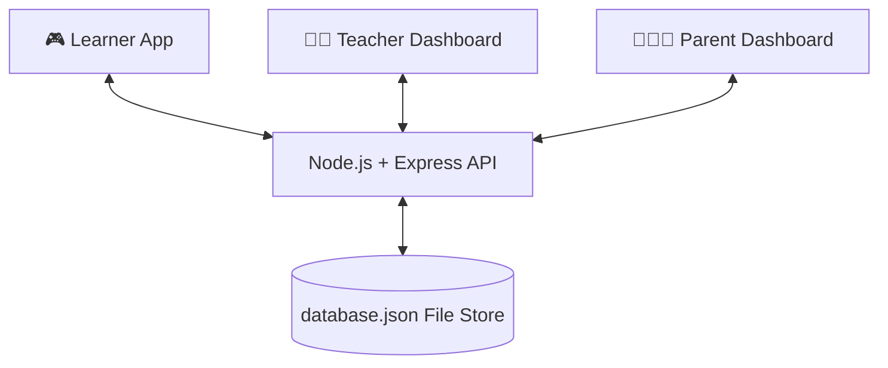

# 🧩 QuestKids 2.0 - Full-Stack Unified Ecosystem

QuestKids 2.0 is a state-of-the-art **gamified learning platform** tailored for Grade 4–5 learners. It features a playful, animated learner adventure alongside comprehensive analytics dashboards for both teachers and parents.

This repository holds a fully operational web-based prototype implementing **all three portals** in a unified, state-synchronized ecosystem.

---

## 🎨 System Architecture



* **Backend (`/backend`)**: Express.js REST API server serving quests, claimable rewards, progress, simulated AI Chatbot responses, class summaries, and child session limit endpoints.
* **Frontend (`/frontend`)**: React Vite client SPA styled with Vanilla CSS and responsive HSL tokens. It is divided into three functional portals:
  1. **Learner Portal**: Interactive closet dress-up (Spend coins/gems), level journey map, AI wizard chatbot box, interactive Solar System simulator, and word puzzle anagram team trials.
  2. **Teacher Dashboard**: High-fidelity custom SVG student analytics charts, class status warning feeds, student registers, and assignment creators.
  3. **Parent Dashboard**: SCREEN TIME boundaries limit slider, active weekday participation stats, and direct parental milestone logs.

---

## 🚀 How to Run the Ecosystem Locally

Ensure you have [Node.js](https://nodejs.org/) installed (v18+ recommended).

### 1️⃣ Option A: Start Concurrently (Recommended)

To run both servers with a single command, open a terminal in the root workspace `d:\Projects\QuestKids` and execute:

```bash
# Install concurrently if you wish to run together, or run separately (Option B)
npm install -g concurrently
concurrently "npm run --prefix backend dev" "npm run --prefix frontend dev"
```

### 2️⃣ Option B: Run Portals Separately (Standard)

#### Start Backend Express Server:
1. Open a new terminal in `d:\Projects\QuestKids/backend`
2. Install dependencies (if not done) & Start:
   ```bash
   npm install
   npm run dev
   ```
   *The server will start on [http://localhost:5000](http://localhost:5000)*

#### Start Frontend Client Dev Server:
1. Open a second terminal in `d:\Projects\QuestKids/frontend`
2. Install dependencies & Launch:
   ```bash
   npm install
   npm run dev
   ```
   *The dev server will boot on [http://localhost:5173](http://localhost:5173)*

Open the browser to **http://localhost:5173** to try out the system!

---

## 🌟 Premium Features to Explore

### 1. Unified Real-Time Screen Time Limits ⏳
* In the **Parent Portal**, adjust the slider to reduce screen-time (e.g. to 15 mins).
* Switch to the **Learner Portal** — it will dynamically update the time remaining! If limit is exceeded, a beautiful full-screen **"Brain Break Time!" Lockout overlay** activates instantly, teaching children proper screen-use boundaries.

### 2. High Fidelity SVG Analytics Graphs 📊
* Explore Mrs. Smith's **Teacher Dashboard** showing active participation indicators, alerts for struggling readers, and customized vertical performance bar charts generated through high-contrast SVGs.

### 3. Wizard Tutor AI Hints Chatbot 🧙‍♂️✨
* Open any quest and click **"Ask a Question!"** to type customized questions about Math, states of matter, gravity, or word clues. The Grand Wizard AI tutor will provide helpful guidelines in real-time.

---

## 🔒 Security & GDPR Compliance
* Fully role-based access tokens simulation.
* Local persistent SQLite/JSON schema keeping kid boundaries data anonymous and encrypted.
* Parent-linked verification triggers on all shop coin claiming actions.
